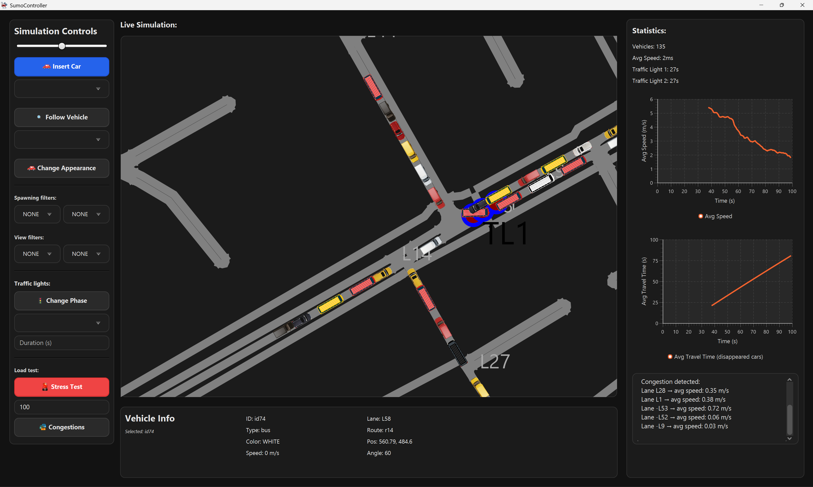
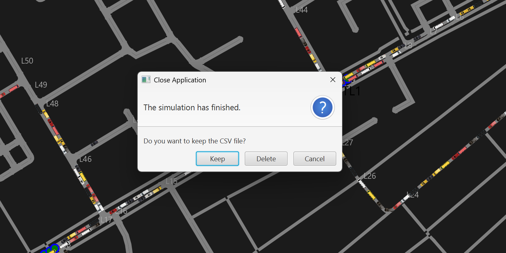

# Sumo Live Simulation – Project Group 4

**Sumo Live Simulation** is a real-time traffic simulation and visualization application developed in **JavaFX** using **Eclipse SUMO** and the **TraaS / LibTraCI API**.  
The application allows users to observe live traffic flow, inject vehicles, control traffic lights, perform stress tests, analyze statistics, and export simulation data.

This project was developed as part of the **Object-Oriented Programming in Java** course (Winter 2025/2026).

---

## Features

### Live Simulation & Visualization
- Real-time rendering of SUMO road networks and lanes
- Animated vehicles rendered on the map
- Traffic lights displayed with current phase indicators
- Smooth **zooming, panning, and map rotation**

### Interaction (Selection + Hover)
- **Vehicle hover info**: hovering a vehicle shows:
  - **ID, Type, Color, Speed, Lane, Route, Position, Angle**
- **Vehicle selection**: click a vehicle to keep its details visible or to change the vehicle via Change Appearance


### Controls
- **Insert Car**: spawn vehicles on selected lanes/edges
- **Change Appearance (live)**: change a selected vehicle’s appearance during runtime (e.g., color/type depending on your options)
- **Follow Vehicle**: camera follows the selected vehicle
- **Simulation speed slider**: adjust simulation speed by changing the internal delay (faster/slower stepping)
- **Stress Test**: inject many vehicles to simulate heavy traffic
- **View Filters**:
  - Display only vehicles matching selected criteria (e.g. vehicle type or color).
  - Non-matching vehicles are temporarily hidden from the map and reappear when filters are cleared.

### Traffic Light Management
- View traffic light state and phase indicators
- **Adjust phase duration** (seconds) from the GUI and observe the impact on traffic flow

### Statistics & Analytics
- Real-time computation and display of:
  - Vehicle count
  - Average speed
  - Average travel time
- **Live Charts**:
  - Real-time chart showing **Average Speed** of all active vehicles.
  - Real-time chart showing **Average Travel Time** of completed (disappeared) vehicles.


### Congestion Reporting (Console Window)
- A built-in **console/terminal-like log panel** prints runtime messages
- The **Congestions** button reports detected congestion spots (location and speed)


### Data Export
- Automatic export of simulation data to **CSV**
- Logged values include:
  - simulation time
  - active vehicle count
  - average speed
  - congestion
  - info about red, yellow, and green traffic lights
- When closing the application, the user is prompted to **keep or delete** the generated CSV file.
---

## Demo

  
*Screenshot of the running application with live map, controls, and statistics.*


*Screenshot of closing options.*

---

## Tech Stack

| Technology | Purpose |
|-----------|--------|
| **Java 17+** | Core programming language (tested with JDK 21 / 25) |
| **JavaFX** | Graphical user interface |
| **Eclipse SUMO** | Traffic simulation engine |
| **TraaS / LibTraCI** | Java API for SUMO control (TraCI) |
| **Maven** | Build & dependency management |
| **Log4j 2** | Logging |

---

## Prerequisites

1. **Java Development Kit (JDK 17 or higher)**
2. **Eclipse SUMO (v1.20.0 or higher)**  
   https://sumo.dlr.de/docs/Downloads.html
3. **Environment Variables**
   - `SUMO_HOME` points to your SUMO installation directory
   - SUMO `bin` directory is included in your system `PATH`

---

## Setup & Run

```bash
git clone https://github.com/lilsemy/SUMO_Group4.git
cd SUMO_Group4
mvn clean install
mvn javafx:run
```

Alternatively, run `Launcher.java` or `Main.java` directly from your IDE.

---

## User Guide

### Map Interaction
- **Pan**: hold left mouse button and drag
- **Zoom**: mouse wheel (cursor-centered)
- **Rotate**: press **Q** / **E**
- **Hover vehicles**: shows ID/type/color/speed/lane/route/position/angle
- **Select vehicle**: click to keep details visible in the *Vehicle Info* panel
- **View filters**: select a vehicle type or color (e.g. red cars) to show only matching vehicles on the map; clearing the filter restores all vehicles.


### Control Panel
- **Simulation speed**: change runtime delay using the speed slider
- **Spawn config**: select vehicle type and color, then click **Insert Car**
- **Change appearance**: change the selected vehicle’s appearance during simulation
- **Traffic lights**:
  - set phase duration (seconds)
- **Stress test**: inject multiple vehicles at once
- **Congestions**: prints detected congestion info into the console window

### Application Exit
- When the simulation is finished and the application is closed, a dialog is shown asking whether the generated CSV file should be kept or deleted.
- Selecting **Keep** preserves the file for later analysis.
- Selecting **Delete** removes the file from the project directory.

---

## Project Structure

```text
SUMO_Group4/
├── src/main/java/com/example/guifx/
│   ├── Main.java                     # Program entry logic
│   ├── Launcher.java                 # JavaFX launcher
│   ├── GUI.java                      # Main JavaFX controller
│   ├── SimulationController.java     
│   ├── SumoConnection.java           # TraaS / SUMO connection wrapper
│   ├── MapSumoConfig.java            # SUMO configuration handling
│   ├── MapUtil.java                  # Coordinate & map utilities
│
│   ├── LaneController.java
│   ├── LaneLayer.java
│   ├── LaneModel.java
│
│   ├── TrafficLightController.java
│   ├── TrafficLightLayer.java
│   ├── TrafficLightModel.java
│   ├── TrafficLightUIState.java
│
│   ├── VehicleController.java
│   ├── VehicleModel.java
│   ├── VehicleState.java
│   ├── VehicleUIState.java
│   ├── VehicleColor.java
│   ├── TypeFilter.java
│
│   ├── SimSnapshot.java              # Snapshot of simulation state
│   ├── Statistics.java               
│   ├── SpawnConfig.java              # Vehicle spawn configuration
│   └── module-info.java
│
├── src/main/resources/
│   └── com/example/guifx/
│       ├── SumoConfig/               # .sumocfg, .net.xml, .rou.xml
│       ├── GUI-view.fxml             # JavaFX layout
│       └── images/                   # Icons and UI assets
│
├── logs/                             # Log files
├── lib/                              # External JARs (LibTraCI)
├── simulation.csv                    # Generated CSV report
├── projectDocumentation.pdf          # Final documentation
├── UI_Changes.md                     # UI evolution notes
├── pom.xml
└── README.md
```

---

## Configuration

SUMO simulation settings are defined in:

```
src/main/resources/com/example/guifx/SumoConfig/
```

You can modify:
- Road networks (`.net.xml`)
- Routes (`.rou.xml`)
- Simulation config (`.sumocfg`)

---

## Export & Reports

- Output file: `simulation.csv`
- Logged values depend on your exporter, typically including:
  - simulation time
  - vehicle count
  - average speed
  - congestion indicator(s)
  - traffic light state summaries

---

## Logging

The application uses a centralized logging system to record runtime information and simulation state changes.

- **Simulation Events**: Logs lifecycle events such as startup, simulation steps, and clean shutdown.
- **Traffic Operations**: Records vehicle spawning, lane insertions, and manual traffic light overrides.
- **Diagnostics**: Monitors congestion hotspots and overall simulation performance.
- **Error Handling**: Captures exceptional situations, including TraCI connection issues and thread interruptions.

**Log Files**: Detailed log records are written to `logs/SumoController.log`, replacing standard console output for diagnostic and debugging purposes.


---
## Troubleshooting

| Issue                    | Solution                                                                |
|--------------------------|-------------------------------------------------------------------------|
| JavaFX errors            | Verify JavaFX is configured correctly                                   |
| Performance drops        | Reduce vehicle count or increase simulation delay                       |
| Missing LibTraCI library | Ensure `libtraci.jar` is present in the `lib/` directory                |
| Dependency errors        | In IntelliJ IDEA, open the Maven tool window and click **Sync Project** |
---

## Course Requirement Coverage

| Requirement (PDF) | Coverage in Our Project |
|---|---|
| Runnable program (JDK 17+) | Runs on Java 17+ and starts via Maven/IDE |
| Live SUMO Integration (TraaS) | Connects to SUMO, steps simulation in real time, reads telemetry, controls entities |
| Interactive Map Visualization | Renders network and vehicles, shows traffic lights, supports zoom/pan/rotation |
| Vehicle filtering (subset display) | Filter by vehicle type/color; non-matching vehicles are hidden and restored when cleared |
| Vehicle Injection & Control | Insert vehicles via GUI on selected lanes/edges; batch injection (stress test); adjustable parameters |
| Traffic Light Management | Shows traffic light state; edit phase durations |
| Statistics & Analytics | Live charts for average speed and average travel time; congestion messages in console |
| Exportable Reports | CSV export generated automatically; user chooses keep/delete on exit |
| Collections | Vehicle and traffic light state stored and updated using Java collections (maps/lists) |
| Error Handling | Includes error handling for exceptional situations; at least one custom exception class |
| Streams & Files | CSV writing using file streams; additional file handling via keep/delete behavior on exit |
| Threads | Simulation thread runs separately from JavaFX UI thread; UI updates via Platform.runLater() |
| Logging | Central logging using Log4j 2 written to `logs/SumoController.log` |
| Clean Code | Code structured and documented following clean code lecture practices |
| Documentation | README + PDF documentation, UML class diagram, work distribution, milestones, class+line requirement mapping |


---

## Credits

- **Eclipse SUMO**  https://sumo.dlr.de
- **JavaFX**  https://openjfx.io
- **Map**  www.openstreetmap.org

Developed by **Project Group 4** (Tuesday Exercises).

---

## License

This project is a **course project**.  
No open-source license is applied. Usage is limited to academic purposes.
